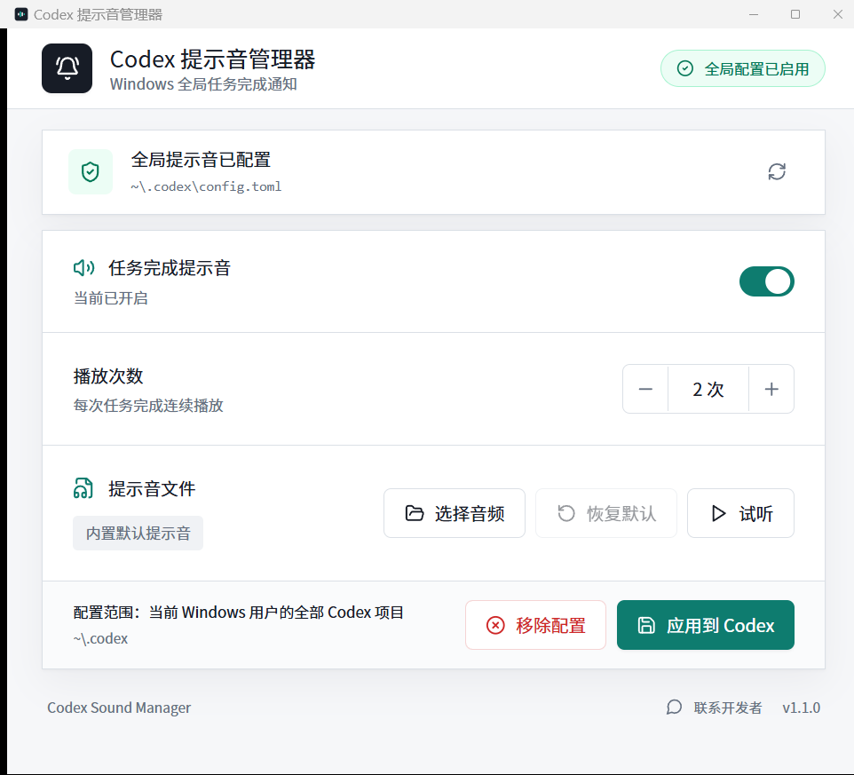

<div align="center">
  
  <h1>Codex 提示音管理器</h1>
  <p>让 Codex 在每次任务完成时播放你喜欢的提示音。</p>
  <p>
    <strong>简体中文</strong> · <a href="README_EN.md">English</a>
  </p>
  <p>
    
    
    
    <a href="https://linux.do"></a>
  </p>
</div>

> 本项目链接并认可 [LINUX DO](https://linux.do) 社区，感谢社区为开源交流提供平台。

## 交流群

扫码加入交流群，联系开发者、反馈问题或交流 Codex 使用经验：

<p align="center">
  
</p>



## 功能亮点

| 功能 | 说明 |
|---|---|
| 自动发现 Codex | 扫描 `CODEX_HOME` 和当前用户的 `~/.codex` |
| 全局生效 | 一套设置覆盖当前 Windows 用户的所有 Codex 对话和项目 |
| 自定义声音 | 支持 WAV、MP3、FLAC、OGG、M4A、AAC，最大 50 MB，选择器默认打开声音库 |
| 播放次数 | 每次任务完成可连续播放 1–10 次 |
| 系统托盘 | 关闭主窗口时可选择退出程序或继续在托盘运行，托盘菜单可恢复窗口和切换状态 |
| 桌面悬浮球 | 科技球体可按需显示，整颗球任意位置都能顺滑拖动，并可双击开关提示音 |
| 原创默认音频 | `sounds/default-notification.wav` 随项目公开分发 |
| 安全修改配置 | 使用 `toml_edit` 保留原 TOML 的注释、顺序和其他字段 |
| 保留已有回调 | 兼容 Codex Computer Use 的 `--previous-notify` 包装 |
| 可随时恢复 | 移除工具配置时恢复安装前的原通知回调 |
| 联系开发者 | 点击窗口底部的小按钮即可查看交流群二维码 |
| 安静运行 | Release 和通知模式不显示黑色控制台窗口 |

## 下载与使用

### 使用安装包

1. 从 GitHub Releases 下载最新的 Windows 安装包。
2. 完成安装后打开 **Codex 提示音管理器**。
3. 确认页面顶部已发现 Codex。
4. 设置启用开关、播放次数、音频文件，并按需开启桌面悬浮球。
5. 点击 **应用到 Codex**。
6. 完整退出并重新打开 Codex。

### 使用便携版

从 GitHub Releases 下载便携 ZIP，完整解压后直接运行：

```text
codex-sound-manager.exe
```

也可以双击同目录的 `Run-Portable.vbs`。源码目录中的这个入口也会自动寻找 `target\release` 下的正式版程序。

## 托盘与桌面悬浮球

- 点击主窗口的关闭按钮后，可以选择 **退出程序**、**最小化到托盘** 或 **取消**。
- 左键点击托盘图标可恢复主窗口；右键菜单可切换提示音、显示或隐藏悬浮球，也可彻底退出程序。
- 在主界面开启 **桌面悬浮球** 后，双击球体可立即开启或关闭提示音；按住球体任意位置拖动即可调整位置；右键点击可打开主窗口。单击不会切换提示音，避免轻微拖动误触。
- 球体会先识别双击，再调用 Tauri 的 `startDragging()` 交给 Windows 原生窗口拖动；移动过程不经过 WebView 逐帧坐标和 IPC 队列，因此会直接跟随系统鼠标，拖动也不会误触提示音开关。
- 主窗口、悬浮球和托盘中的提示音开关都会立即保存，下一次任务完成直接生效，不需要点击 **应用到 Codex**，也不需要重启 Codex。
- 修改播放次数或提示音文件后仍需点击一次 **应用到 Codex**；如果全局回调已经配置，这些设置同样无需重启 Codex。

## 从源码启动

### 一键启动开发版

双击：

```text
Start-Dev.cmd
```

或在 PowerShell 中执行：

```powershell
npm install
npm run tauri -- dev
```

开发模式会保留一个终端窗口，用于 Vite 热更新和 Rust 编译日志，这是正常现象。正式 Release EXE 和任务完成通知不会显示该窗口。

## 一键打包发布包

双击：

```text
Build-Release.cmd
```

或执行：

```powershell
.\scripts\Build-Release.ps1
```

脚本会先校验所有版本号一致，再安装前端依赖、生成并同步 Tauri 图标、执行 TypeScript 检查、Rust 单元测试、Clippy 检查并构建 Tauri Release。

构建产物：

| 产物 | 路径 |
|---|---|
| 便携 EXE | `target\release\codex-sound-manager.exe` |
| NSIS 安装包 | `target\release\bundle\release\CodexSoundManager_1.3.7_x64-setup.exe` |
| 便携 ZIP | `target\release\bundle\portable\CodexSoundManager_1.3.7_x64-portable.zip` |
| SHA-256 校验 | `target\release\bundle\release\SHA256SUMS.txt` |

构建环境需要 Node.js、Rust、Microsoft C++ Build Tools 和 WebView2。

## 默认声音与自定义声音

项目内默认提示音：

```text
sounds\default-notification.wav
```

该音频由 `scripts/generate_default_sound.py` 原创生成，峰值约为 `-1.1 dBFS`，可随 MIT 许可公开分发。

用户选择自定义音频时，文件选择器会默认打开下面的声音库；选中的文件也会复制到这里：

```text
~\.codex\codex-sound-manager\sounds\
```

点击界面中的 **恢复默认** 即可重新使用项目内置声音。

`v1.1.0` 会自动迁移旧版 `%LOCALAPPDATA%\CodexSoundManager` 以及 Codex 包目录中的设置和自定义音频，避免不同启动方式读取到两份设置。

## 配置与隐私

- Codex 设置：`%CODEX_HOME%\config.toml`
- 首次配置备份：`%CODEX_HOME%\config.toml.codex-sound-manager.bak`
- 工具设置：`~\.codex\codex-sound-manager\settings.json`
- UTF-8 运行日志：`~\.codex\codex-sound-manager\notifier.log`

程序不会上传 Codex 配置、自定义音频或日志，也不会读取对话内容。Codex 传入的任务结束参数只用于继续转发已有通知回调。

## 常见问题

### 为什么其他对话没有声音？

修改 `config.toml` 后需要完整重启 Codex。只关闭当前窗口但保留后台进程，其他已打开任务仍可能使用旧配置。

### 为什么开发版有黑色窗口？

开发模式需要终端承载热更新和编译日志。Release EXE、安装版和 `--notify` 模式均使用 Windows GUI 子系统，不显示黑色控制台窗口。

### 为什么听不到声音？

先在工具中点击 **试听**。若试听也没有声音，请检查 Windows 音量合成器、默认输出设备以及音频文件是否仍存在。

### 最小化到托盘后如何彻底退出？

右键点击系统托盘中的程序图标，然后选择 **退出程序**。再次打开主窗口并点击关闭按钮，也可以选择 **退出程序**。

### 移动程序后为什么失效？

Codex 配置保存的是 EXE 的绝对路径。移动便携版后，重新打开工具并点击 **应用到 Codex** 即可更新路径。

## 技术栈

- Tauri 2 + Rust
- React 19 + TypeScript
- Tailwind CSS + Shadcn 风格组件
- Radix UI + Lucide 图标
- rodio + Symphonia 音频解码
- toml_edit 配置编辑

## 项目结构

```text
CodexSoundManager/
├─ frontend/             React 设置界面
├─ src/                  Rust/Tauri 核心
├─ sounds/               默认提示音
├─ assets/               Noto Sans CJK SC 字体
├─ docs/images/          截图与交流群二维码
├─ scripts/              图标、声音和发布脚本
├─ AGENTS.md             版本、编码与交付维护规则
├─ Start-Dev.cmd         一键开发启动
├─ Build-Release.cmd     一键发布构建
└─ Run-Portable.vbs      无控制台启动便携版
```

## 许可证

项目代码和原创默认提示音使用 [MIT License](LICENSE)。Noto Sans CJK SC 及其他第三方组件许可见 [THIRD_PARTY_NOTICES.md](THIRD_PARTY_NOTICES.md)。
